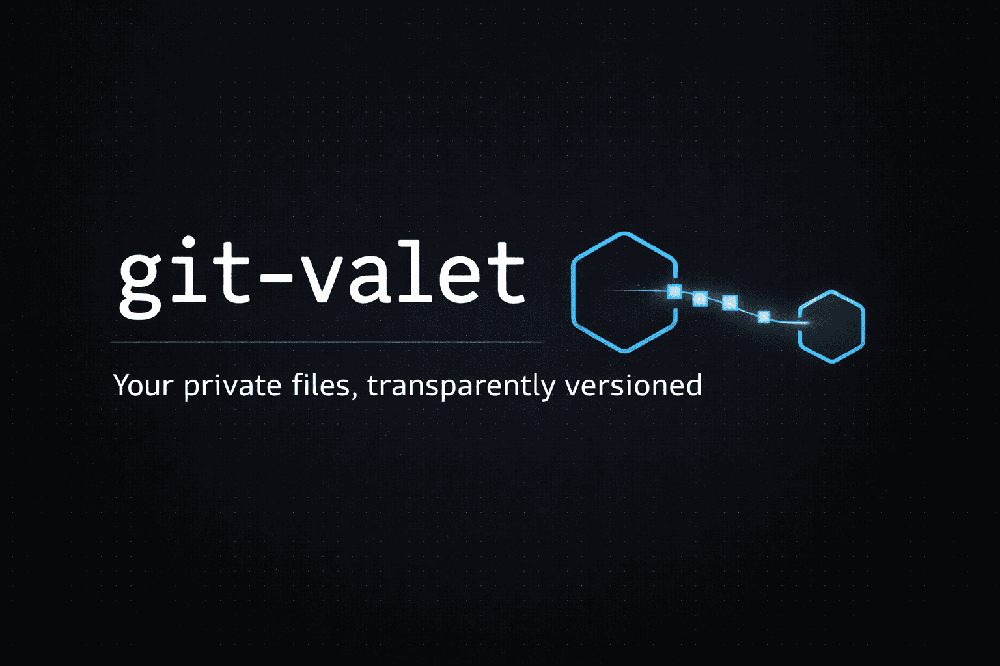

<p align="center">
  
</p>

# git-valet

> Transparently version private files (.env, secrets, notes, AI prompts) in a **separate private repo**, synced via git hooks. Zero workflow change.

**git-valet** is a Rust CLI that acts as a transparent valet service for your git repositories. It keeps sensitive or personal files versioned in a private repository — automatically synced every time you commit, push, pull, or checkout — without touching your main repo's history.

Git automatically recognizes `git valet` as a subcommand (`git-<name>` convention).

## Why git-valet?

Some files need to be versioned but don't belong in your main repo — private configs, secrets, AI prompts, local tooling, notes, anything you want tracked but kept separate.

```
my-project/           ← public repo
├── .gitignore        ← ignores .env, notes/
├── .env              ← you want this versioned ELSEWHERE
├── notes/            ← same
└── src/
```

You want these files versioned in a private repo, without changing your git workflow at all. That's what git-valet does.

## Why git-valet over alternatives?

| | git-valet | git-secret | git-crypt | Transcrypt | .gitignore + manual |
|---|---|---|---|---|---|
| **Separate private repo** | ✅ | ❌ | ❌ | ❌ | ❌ |
| **Transparent git hooks** | ✅ | ❌ | ❌ | ❌ | ❌ |
| **No encryption needed** | ✅ | ❌ | ❌ | ❌ | ✅ |
| **No GPG/key management** | ✅ | ❌ | ❌ | ❌ | ✅ |
| **Zero workflow change** | ✅ | ❌ | ❌ | Partial | ❌ |
| **Works with any file type** | ✅ | ✅ | ✅ | ✅ | ✅ |

**git-secret / git-crypt / Transcrypt** encrypt files *inside* your repo. **git-valet** moves files to a *separate* repo entirely — no encryption overhead, no key management, no risk of accidentally pushing decrypted secrets.

## Use cases

- **AI/LLM prompts** — Keep your prompt library versioned but private
- **Environment configs** — Track .env files across machines without exposing secrets
- **Personal notes** — Version project notes alongside code without polluting the repo
- **Client-specific configs** — Consultants working on shared repos with private overrides
- **Local tooling** — IDE configs, custom scripts, dev-only files

## Installation

### Prerequisites

- Rust + Cargo: https://rustup.rs
- Git

### Build & install

```bash
git clone https://github.com/JSpatim/git-valet
cd git-valet
cargo install --path .
```

The `git-valet` binary is installed in `~/.cargo/bin/` (already in your PATH if Rust is installed).

### From crates.io

```bash
cargo install git-valet
```

## Usage

### Setup (once per project)

```bash
cd my-project

git valet init git@github.com:you/my-project-private.git .env config/local.toml notes/
```

What this does:

- Creates a bare repo in `~/.git-valets/<id>/repo.git`
- Adds the tracked files to the main repo's `.gitignore`
- Installs git hooks (pre-commit, pre-push, post-merge, post-checkout)
- Makes an initial commit + push if the files already exist

### Daily workflow — nothing changes

```bash
# Your usual commands work as before
git add src/
git commit -m "feat: new feature"   # → also commits the valet if modified
git push                             # → also pushes the valet
git pull                             # → also pulls the valet
```

### Manual commands (if needed)

```bash
git valet status          # show valet repo status
git valet sync            # manual add + commit + push
git valet push            # push only
git valet pull            # pull only
git valet add secrets.yml # add a new file to the valet
git valet deinit          # remove git-valet from this project
```

## On a new machine

```bash
# 1. Clone your main repo
git clone git@github.com:you/my-project.git
cd my-project

# 2. Re-initialize git-valet for this project
git valet init git@github.com:you/my-project-private.git .env config/local.toml notes/
```

## Architecture

```
~/.git-valets/
└── <project-id>/
    ├── repo.git/          ← valet bare repo
    └── config.toml        ← remote, work-tree, tracked files
```

The config is **never** stored in the main repo — only in `~/.git-valets/`.

## Files installed in the main repo

Only `.gitignore` is modified (tracked file entries are added).
Git hooks are added to `.git/hooks/` (not versioned).

## How it works

1. `git valet init` creates a bare git repository outside your project
2. Git hooks are installed in your main repo
3. When you `git commit`, the pre-commit hook detects changes in valet-tracked files and commits them to the valet repo
4. When you `git push`, the pre-push hook also pushes the valet repo
5. When you `git pull` / `git checkout`, post-merge / post-checkout hooks pull the valet repo

All of this happens transparently — you never interact with the valet repo directly unless you want to.

## Contributing

Contributions are welcome! Please open an issue or submit a pull request.

## Security

If you discover a security vulnerability, please open a private security advisory on GitHub.

## License

[MIT](LICENSE)
